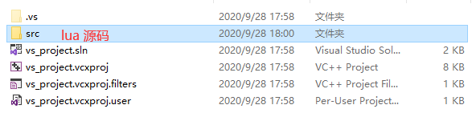
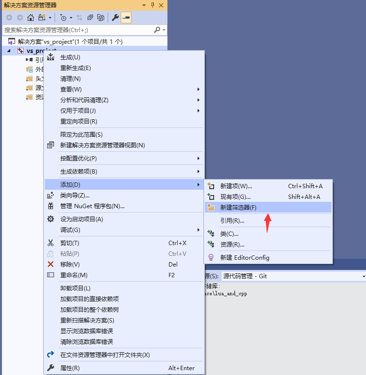
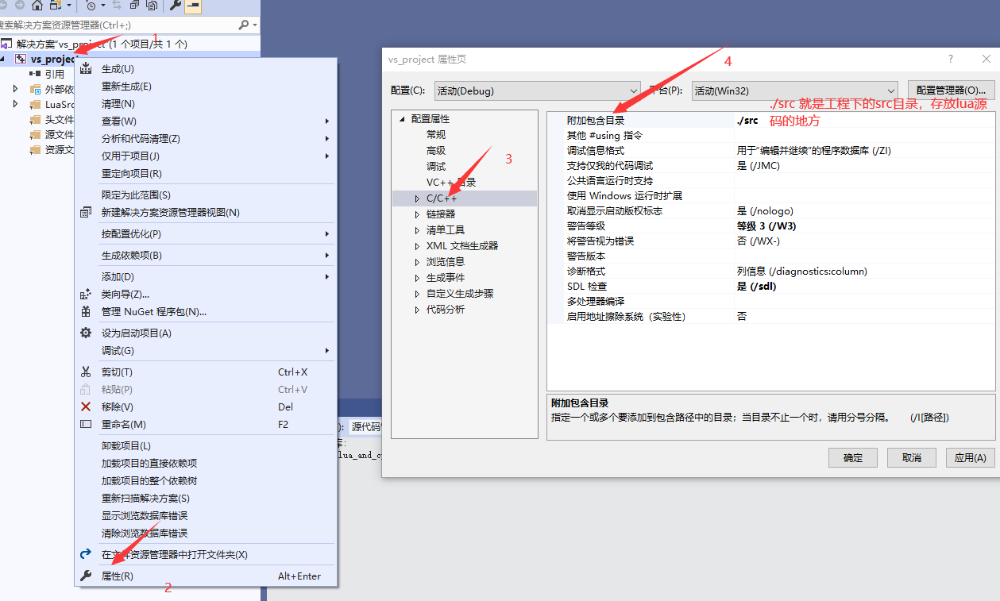

## 编译独立版lua

### 编译解释器

在windows 平台下测试

1. 新建一个**控制台程序**

2. 把lua 源码复制到项目根目录



3. 添加筛选器 LuaSrc, 存放lua 的源码



把lua 的源码托到LuaSrc里

4. 附加包含目录



5. 移除LuaSrc 中的luac.c 文件和源文件里的lua 解释器.cpp，选中release 模式编译代码

说明: lua 解释器.cpp == $(project_name).cpp


编译成功后就会在 `项目目录/Release/` 找到lua 解释器.exe, 编译解释器成功


### 编译 编译器

#### 编译过程

重复 *编译解释器的* 1-4 步。

5. 移除LuaSrc 中的lua.c 文件和源文件里的lua 编译器.cpp，选中release 模式编译代码

说明: lua 编译器.cpp == $(project_name).cpp

编译成功后就会在 `项目目录/Release/` 找到lua 编译器.exe, 编译编译器成功


#### 编译器怎么使用

新建一个文件 `test.lua`, 写下如下代码:

```lua
print("test 编译器")
```

用编译器编译: 


得到二进制文件luac.out

在上 *解释器* 解释执行


## 编译内嵌模式lua

### 编译动态库

1. 新建一个**动态连接库**

2. 把lua 源码复制到项目根目录


3. 添加筛选器 LuaSrc, 存放lua 的源码


把lua 的源码托到LuaSrc里

4. 附加包含目录


5. 不适用预编译头


6. 预处理器定义一个宏，`LUA_BUILD_AS_DLL`


7. 移除LuaSrc 中的luac.c, lua.c 文件，选中release 模式编译代码


### 编译静态库

1. 新建一个**静态库**

2. 把lua 源码复制到项目根目录


3. 添加筛选器 LuaSrc, 存放lua 的源码


把lua 的源码托到LuaSrc里

4. 附加包含目录


5. 不适用预编译头


6. 移除LuaSrc 中的luac.c, lua.c 文件，选中release 模式编译代码

