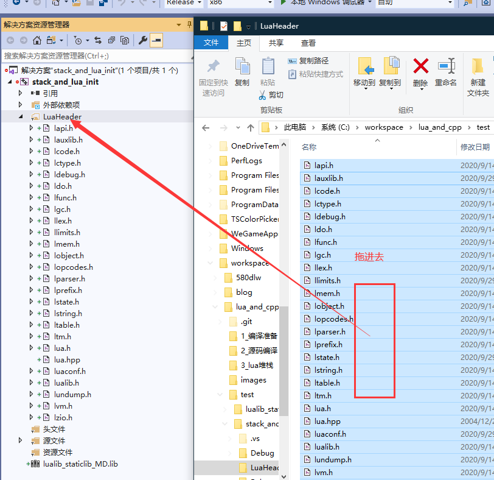
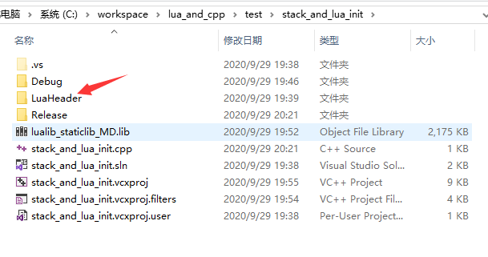
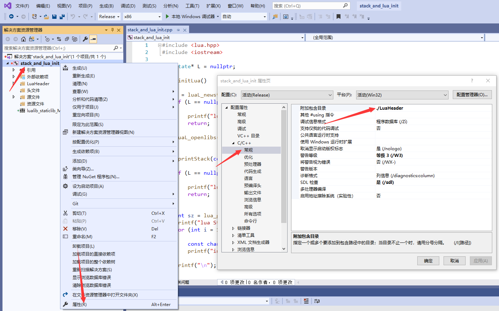
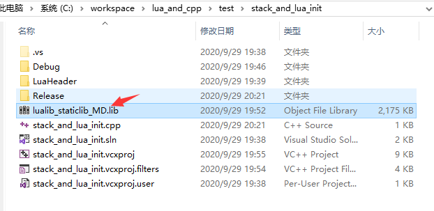
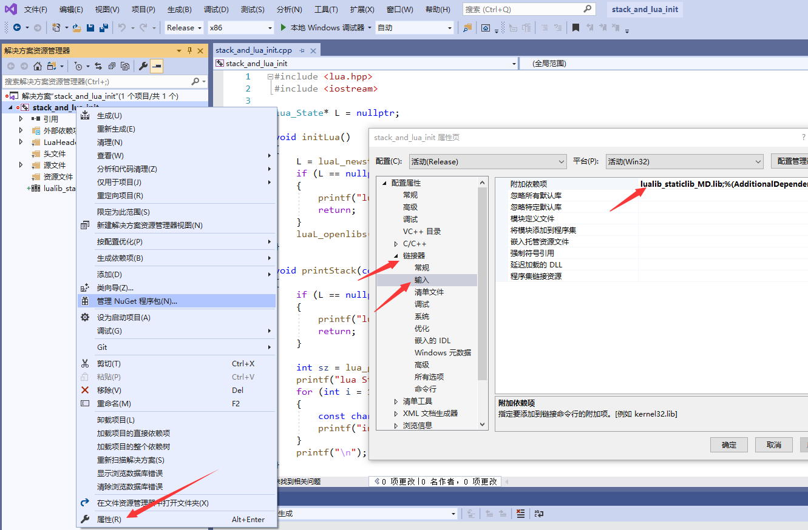

### 测试环境

1. 新建一个 *控制台* 程序
2. 新建一个 *筛选器*，把lua源代码中的头文件包含进去

	

3. 把头文件复制包含到项目根目录

	

4. 附加包含目录

	

5. 把之前编译的静态链接库复制到项目根目录

	

6. 链接器附加依赖项

	

以上步骤环境就构造好了。


### 初始化 lua 栈

Lua 使用一个 虚拟栈 来和 C 互传值。 栈上的的每个元素都是一个 Lua 值 （nil，数字，字符串，等等）。

无论何时 Lua 调用 C，被调用的函数都得到一个新的栈， 这个栈独立于 C 函数本身的栈，也独立于之前的 Lua 栈。

方便起见， 所有针对栈的 API 查询操作都不严格遵循栈的操作规则。 而是可以用一个 索引 来指向栈上的任何元素： 正的索引指的是栈上的绝对位置（从1开始）； 负的索引则指从栈顶开始的偏移量。 展开来说，如果堆栈有 n 个元素， 那么索引 1 表示第一个元素 （也就是最先被压栈的元素） 而索引 n 则指最后一个元素； 索引 -1 也是指最后一个元素 （即栈顶的元素）， 索引 -n 是指第一个元素。


#### luaL_newstate

`lua_State *luaL_newstate(void);`

创建一个新的 Lua 状态机。 它以一个基于标准 C 的 realloc 函数实现的内存分配器 调用 lua\_newstate 。

返回新的状态机。 如果内存分配失败，则返回 NULL 。


#### luaL_openlibs

`void luaL_openlibs (lua_State *L);`

打开指定状态机中的所有 Lua 标准库。


#### lua_gettop

`int lua_gettop (lua_State *L);`

返回栈顶元素的索引。 因为索引是从 1 开始编号的， 所以这个结果等于栈上的元素个数； 特别指出，0 表示栈为空。

#### lua_settop

`void lua_settop (lua_State *L, int index);`

参数允许传入任何索引以及 0 。 它将把堆栈的栈顶设为这个索引。 如果新的栈顶比原来的大， 超出部分的新元素将被填为 nil 。 如果 index 为 0 ， 把栈上所有元素移除。

#### lua_tolstring

`const char *lua_tolstring (lua_State *L, int index, size_t *len);`

把给定索引处的 Lua 值转换为一个 C 字符串。 如果 len 不为 NULL ， 它还把字符串长度设到 \*len 中。 这个 Lua 值必须是一个字符串或是一个数字； 否则返回 NULL 。 如果值是一个数字， lua\_tolstring 还会 把堆栈中的那个值的实际类型转换为一个字符串。 （当遍历一张表的时候， 若把 lua\_tolstring 作用在键上， 这个转换有可能导致 lua\_next 弄错。）

lua_tolstring 返回一个已对齐指针 指向 Lua 状态机中的字符串。 这个字符串总能保证 （ C 要求的）最后一个字符为零 ('\0') ， 而且它允许在字符串内包含多个这样的零。

因为 Lua 中可能发生垃圾收集， 所以不保证 lua_tolstring 返回的指针， 在对应的值从堆栈中移除后依然有效。

#### lua_tostring

`const char *lua_tostring (lua_State *L, int index);`

等价于调用 lua_tolstring ， 其参数 len 为 NULL 。


#### lua_pushstring

`const char *lua_pushstring (lua_State *L, const char *s);`

将指针 s 指向的零结尾的字符串压栈。Lua 对这个字符串做一个内部副本（或是复用一个副本）， 因此 s 处的内存在函数返回后，可以释放掉或是立刻重用于其它用途。

返回内部副本的指针。

如果 s 为 NULL，将 nil 压栈并返回 NULL。


示例代码:

```c++
#include <lua.hpp>
#include <iostream>

lua_State* L = nullptr;

void initLua()
{
	L = luaL_newstate();
	if (L == nullptr)
	{
		printf("lua 初始化失败!");
		return;
	}
	luaL_openlibs(L);
}

void printStack(const char* tag)
{
	if (L == nullptr)
	{
		printf("lua_State * is nullptr <%s>\n", tag);
		return;
	}

	int sz = lua_gettop(L);
	printf("lua Stack Size:%d; <%s>\n", sz, tag);
	for (int i = 1; i <= sz; ++i)
	{
		const char *str = lua_tostring(L, i);
		printf("index: %d, value: %s <%s>\n", i, str, tag);
	}
	printf("\n");
}

int main()
{
	initLua();
	printStack("initLua");
	lua_pushstring(L, "a");
	printStack("push a");

	lua_pushstring(L, "b");
	printStack("push b");

	lua_pushstring(L, "c");
	printStack("push c");

	lua_pushstring(L, nullptr);
	printStack("push nullptr");

	lua_settop(L, 1);
	printStack("settop 1");
}

```